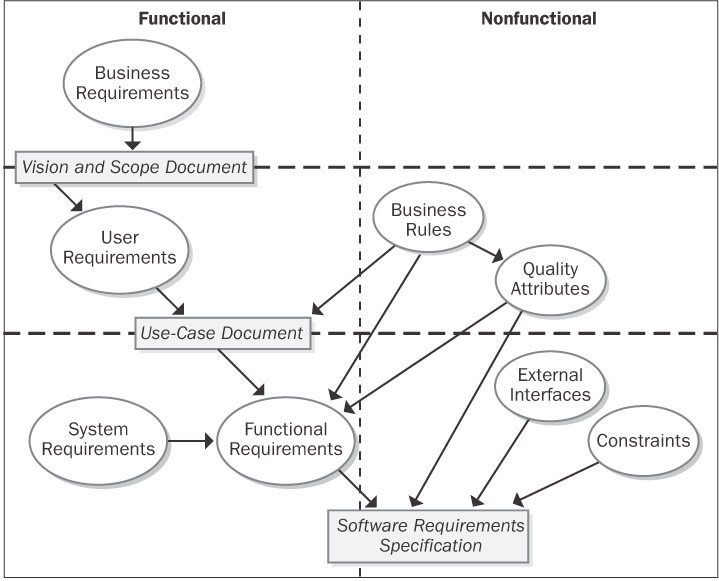
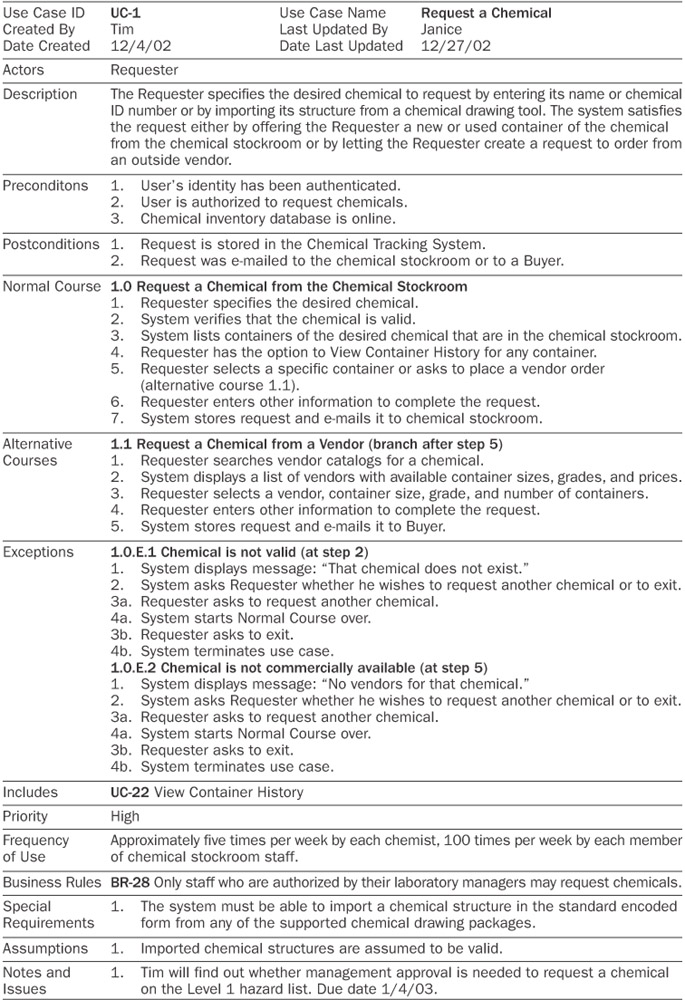

Software Requirements (2nd ed)
==============================

## 1. Business Requirements

1.1 Background

* A general description of the history or situation that led to the decision to build this product.

1.2 Business Opportunity

* the market opportunity that exists and the market in which the product will be competing
* the business problem that is being solved or the business process being improved
* comparative evaluation of existing products and potential solutions, indicating why the proposed product is attractive and the advantages it provides
* Describe the problems that cannot currently be solved without the product
* Show how it aligns with market trends, technology evolution, or corporate strategic directions. Include a brief description of any other technologies, processes, or resources required to provide a complete customer solution.

1.3 Business Objectives and Success Criteria

* financial and non-financial business objectives
* Define how the stakeholders will define and measure success on this project
* the factors that have the greatest impact on achieving that success, including factors both within and outside the organization's control
* Specify measurable criteria to assess whether the business objectives have been met.

1.4 Customer or Market Needs

1.5 Business Risks

* the major business risks associated with developing—or not developing—this product
* Estimate the potential loss from each risk, the likelihood of it occurring, your ability to control it, and any potential mitigation actions

## 2. Vision of the Solution

2.1 Vision Statement

* For [target customer]
* Who [statement of the need or opportunity]
* The [product name]
* Is [a product category]
* That [key benefit, compelling reason to buy or use]
* Unlike [primary competitive alternative, current system, or current business process],
* Our product [statement of primary differentiation and advantages of new product].

2.2 Major Features
* Give each feature a unique label

2.3 Assumptions and Dependencies

## 3. Scope and Limitations

3.1 Scope of Initial Release

* the major features that are planned for inclusion in the initial release
* the quality characteristics that will let the product provide the intended benefits to its various user classes (eg. “My colleague Scott's last project team decided that users had to be able to run their package delivery business with the first software release. Version 1 didn't have to be fast, pretty, or easy to use, but it had to be reliable; this focus drove everything the team did.”)

3.2 Scope of Subsequent Releases

3.3 Limitations and Exclusions

* Defining the boundary between what's in and what's out

## 4. Business Context

4.1 Stakeholder Profiles

4.2 Project Priorities

* matrix between time,cost,scope,quality and the following:
  * _A constraint_ - A limiting factor within which the project manager must operate
  * _A driver_ - A significant success objective with limited flexibility for adjustment
  * _A degree of freedom_ - A factor that the project manager has some latitude to adjust and balance against the other dimensions
* Suppose marketing suddenly demands that you release the product one month earlier than scheduled. How do you respond? The project priorities dictate the actions you take when such eventualities arise.

4.3 Operating Environment

* System environment from technical & business perspectives.
* define the vital quality attributes such as availability, reliability, performance, and integrity requirements

## ?. Context Flow Diagram

## Ch 6 - Finding Customer Voice

* Sources of Requirements:
  * Interviews and discussions with potential users
  * Documents that describe current or competing products
  * Problem reports and enhancement requests for a current system
  * Observing users at work
  * Marketing surveys and user questionnaires
  * Scenario analysis of user tasks
  * Events and responses (the external events to which the system must react and the appropriate responses)
* Create user classes
  * user classes need not be human beings
  * try to think from the perspective of each user class

## Ch 7 - Hearing Customer Voice

* x "What do you want?" - results in lots of random information
  o "What do you need to do?"

* Types of requirements:

  

* Probe around the exceptions. What could prevent the user from successfully completing a task? How should the system respond to various error conditions? Ask questions that begin with "What else could…," "What happens when…," "Would you ever need to…," "Where do you get…," "Why do you (or don't you)…," and "Does anyone ever…"

* You’ll never discover all of your requirements up front.

* How to find missing requirements:
  * Decompose high-level reqs into non-vague detail. Avoid words like: support, enable, permit, process, and manage.
  * Make sure all user classes have provided input.
  * Trace requirements, use cases etc. to make sure nothing is missing from detailed functional requirements.
  * Check boundaries (like testing)
  * Use pictures instead of words.
  * Requirements with boolean logic (AND, NOT, OR) should be examined for all combinations of true/false.
  * CRUDL matrix between use-cases and entities.

* A requirements technique often used for real-time systems is to list the external events to which the system must react and the corresponding system responses.

  

* Estimating the frequency of use provides an early indicator of concurrent usage and capacity requirements.

* Use UML use cases

* Give each use-case:
  * a unique id
  * a name like “verb + object”
  * Pre/Post conditions

* Consider flowcharts for each use-case and add alternative paths

* When use case flows into another the post and pre conditions should line up.

* Identify exceptions

* Wait 2, 3 days between iterations of requirements analysis

* Use cases are user-centric, devs need functional requirements

* Event-response diagram:

  

## Ch 8 - Understanding User Requirements

* Use-Case traps:
  * Too many.
  * Too complex.
  * Including UI design.
  * Including data definitions.
  * Use cases that users can’t understand.
  * Describing a new business process.
  * Too much <includes> and <extends>

## Ch 9 - Rules

Types of business rules:

* Facts
  * Every order must have a shipping charge.
* Constraints
  * A library patron may place up to 10 items on hold.
* Action Enablers
  * If <condition>, then <action>
  * On the last day of a calendar quarter, generate the mandated OSHA and EPA reports on chemical handling and disposal for that quarter.
* Computations
  * The domestic ground shipping charge for an order that weighs more than 2 pounds is $4.75 plus 12 cents per ounce or fraction thereof.
* Inferences/Inferred Knowledge
  * If <cond>, then <fact/information>
  * A container of a chemical that can form explosive decomposition products is considered expired one year after its manufacture date.

## Ch 10 - Documenting

* SRS target audiences:
  * Devs - design
  * Testers - write test cases
  * Customers, sales, marketing - sets expectations
  * Support/Ops - understand

* You don't have to write the SRS for the entire product before beginning development, but you do need to capture the requirements for each increment before building that increment.

* SRS template:

  

* Ambiguous Terms to Avoid in Requirements Specifications

  | Ambiguous Terms | Ways to Improve Them |
  |-----------------|----------------------|
  | acceptable, adequate | Define what constitutes acceptability and how the system can judge this. |
  | as much as practicable | Don't leave it up to the developers to determine what's practicable. Make it a TBD and set a date to find out. |
  | at least, at a minimum, not more than, not to exceed | Specify the minimum and maximum acceptable values. |
  | between | Define whether the end points are included in the range. |
  | depends on | Describe the nature of the dependency. Does another system provide input to this system, must other software be installed before your software can run, or does your system rely on another one to perform some calculations or services? |
  | efficient | Define how efficiently the system uses resources, how quickly it performs specific operations, or how easy it is for people to use. |
  | fast, rapid | Specify the minimum acceptable speed at which the system performs some action. |
  | flexible | Describe the ways in which the system must change in response to changing conditions or business needs. |
  | improved, better, faster, superior | Quantify how much better or faster constitutes adequate improvement in a specific functional area. |
  | including, including but not limited to, and so on, etc., such as | The list of items should include all possibilities. Otherwise, it can't be used for design or testing. |
  | maximize, minimize, optimize | State the maximum and minimum acceptable values of some parameter. |
  | normally, ideally | Also describe the system's behavior under abnormal or non-ideal conditions. |
  | optionally | Clarify whether this means a system choice, a user choice, or a developer choice. |
  | reasonable, when necessary, where appropriate | Explain how to make this judgment. |
  | robust | Define how the system is to handle exceptions and respond to unexpected operating conditions. |
  | seamless, transparent, graceful | Translate the user's expectations into specific observable product characteristics. |
  | several | State how many, or provide the minimum and maximum bounds of a range. |
  | shouldn't | Try to state requirements as positives, describing what the system will do. |
  | state-of-the-art | Define what this means. |
  | sufficient | Specify how much of something constitutes sufficiency. |
  | support, enable | Define exactly what functions the system will perform that constitute supporting some capability. |
  | user-friendly, simple, easy | Describe system characteristics that will achieve the customer's usage needs and usability expectations. |

* Watch out for analysis paralysis. You can't spend forever trying to perfect the requirements. Your goal is to write requirements that are *good enough* to let your team proceed with design and construction at an acceptable level of risk.

* Characteristics of high-quality requirement statements: complete, correct, feasible, necessary, prioritized, unambiguous, and verifiable.

* Use a glossary and a data dictionary

## Ch 11 - Diagrams

* No single view of the requirements provides a complete understanding.
* Focus your modeling on the most complex and riskiest portions of the system and on those portions most subject to ambiguity or uncertainty.
* Nouns become:
  * Terminators or data stores (DFD)
  * Actors (use-case diagram)
  * Entities or their attributes (ERD)
  * Classes or their attributes (class diagram)
* Verbs become:
  * Processes (DFD)
  * Use cases (use-case diagram)
  * Relationships (ERD)
  * Transitions (STD)
  * Activities (activity diagram)
* System context diagram (SCD) = context-level data-flow diagram
* DFDs
  * Processes communicate through data stores, not by direct flows from one process to another. Similarly, data cannot flow directly from one store to another; it must pass through a process bubble.
  * Name each process as a concise action: verb + object
  * Number the processes uniquely and hierarchically. On the level 0 diagram, number each process with an integer. If you create a child DFD for process 3, number the processes in that child diagram 3.1, 3.2, and so on.
  * Don't show more than eight to ten processes on a single diagram.
  * Process bubbles with flows that are only coming in or only going out are suspect.
* ERDs
  * Have a verb describe each relationship (i.e. listing, describing, containing)
* State transition diagrams (STD)
* Dialog maps (STDs for GUI), similar to navigation maps.
* Class diagram
* Decision tables

## Ch 12 - Quality Attributes

* Quality, in its many dimensions, must be defined both by the customers and by those who will build, test, and maintain the software.
* Differentiate quality characteristics that apply to the entire product from those that are specific to certain components, certain user classes, or particular usage situations.
* [reliability] Establish quantitative reliability requirements based on how severe the impact would be if a failure occurred and whether the cost of maximising the reliability is justifiable.
* Don’t forget to consider how you’ll evaluate a product to see whether it satisfies its quality attributes.

  

## Ch 13

* Horizontal prototypes don’t do anything but look like they should.
* Vertical prototypes (proof of concept) implements a slice of application functionality for real.

## Ch 14 - Prioritising Requirements
* Ask:
  * Is there some other way to satisfy the need that this requirement addresses?
  * What would the consequence be of omitting or deferring this requirement?
  * What would the impact be on the project's business objectives if this requirement weren't implemented immediately?
  * Why would a user be unhappy if this requirement were deferred to a later release?
* Use a prioritisation matrix (Table 14-2)
  * Heading: Benefit (Value). 1=Will never be used. 9=Everyone will find it useful
  * Heading: Penalty (Value). 1=no one will be upset if it's excluded. 9=serious downside
  * Heading: Value: Benefit + Penalty. (Benefit and Penalty can be optionally weighted too.)
  * Heading: Cost. 1 (quick and easy) to 9 (time consuming and expensive)
  * Heading: Risk. 1=can program it in your sleep. 9 = serious concerns about feasibility, the lack of staff with the necessary expertise, or the use of unproven or unfamiliar tools and technologies.
  * Sum up value, cost, risk and then divide each individual value, cost, risk by the total. (eg. Item #2 has 18% of the total risk of all items)
  * priority = `(value %) / ((cost % * cost weight) + (risk % * risk weight))`
* Tools exist:
  * Quality Function Deployment (QFD)
  * Total Quality Management (TQM)

## Ch 15 - Validation

* Studies have shown that it can cost approximately 100 times more to correct a customer-reported requirement defect than to correct an error found during requirements development (Boehm 1981; Grady 1999). Another study found that it took an average of 30 minutes to fix an error discovered during the requirements phase. In contrast, 5 to 17 hours were needed to correct a defect identified during system testing (Kelly, Sherif, and Hops 1992).
* The participants in an inspection should be: req author (BA), customer, dev, interfacing-system devs
* **Excellent requirement statements = complete, correct, feasible, necessary, prioritized, unambiguous, and verifiable**
* **Excellent requirements specifications = complete, consistent, modifiable, and traceable**

## Ch 16

* When someone on your team has to modify the existing system, he should create a partial requirements traceability matrix to link the new or changed requirements to the corresponding design elements, code, and test cases. Accumulating traceability links as you perform the development work takes little effort, whereas it's nearly impossible to regenerate the links from a completed system.

## Ch 17

* Example versioning scheme: “Version 1.0 draft 2”
* Have JIRA-like statuses that requirements are in. Have a state-transition diagram to document the workflow. Move requirements through states as they get designed, implemented, etc.

## Ch 21

* Requirements tools show a trend of integrating with:
  * Version control tools
  * Design Modelling tools
  * Project estimation tools
  * Project tracking tools
  * Change request tools
  * Test management tools