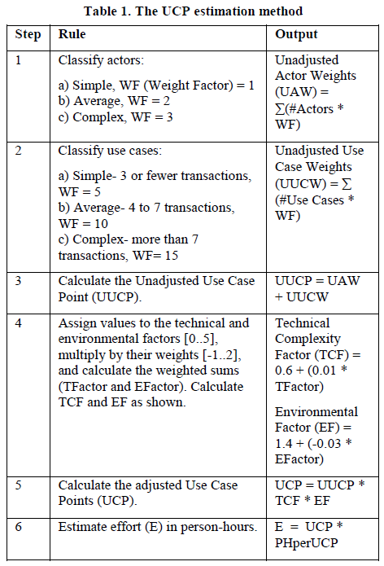

Software Requirements II (More About)
=====================================

## Ch 1

* Business requirement = why. Benefits to customers and developing organisation.

* User requirement = what from user perspective. Goals, tasks, stories, event-response tables.

* Functional requirement = what from dev perspective.

* Definition of requirement types:

|  |  |  |
| --- | --- | --- |
| **Business requirement** | Anything that describes the financial, marketplace, or other business benefit that either customers or the developing organization wish to gain from the product.  Business requirements represent a kind of "why" information. Business requirements describe why the organization is undertaking the project. They state some benefits that the developing organization or its customers expect to receive from the product. | *"Increase market share by X%."  "Save $Y per year on electricity now wasted by inefficient units."  "Save $Z per year in maintenance costs that are consumed by legacy system W."* |
| **Use case** | General statements of user goals or business tasks that users need to perform.  A description of a sequence of interactions between the system and one or more external actors.  The name given to a use case should always indicate the value the use case will deliver to an actor. By convention, a use case name always begins with a verb. The name also contains an object, which is a noun. Adjectives and adverbs are optional. | *"I need to [do something]"  "Reverse Rental Car" "Print Invoice" "Check Flight Status"* |
| **Business rule** | Rules that the software must confirm to.  Not functional requirements.  Business rules include corporate policies, government regulations, industry standards (such as accounting practices), and computational algorithms. | *"Must comply with [some law or corporate policy]"  "Must conform to [some standard]"  "If [some condition is true], then [something happens]"  "Must be calculated according to [some formula]"* |
| **Functional requirement** | Observable behaviours the system will exhibit under certain conditions and the actions the system will let users take.  Functional requirements represent another kind of "what" information. They describe what the developer is supposed to build. Sometimes called behavioural requirements, these are the traditional "shall" statements that describe what the system "shall do" or what the system "shall let the user do." | *"If the pressure exceeds 40.0 psi, the high pressure warning light should come on."  "The user must be able to sort the project list in forward and reverse alphabetical order."  "The system sends an e-mail to the Idea Coordinator whenever someone submits a new idea."* |
| **Quality attributes** | Statements that indicate how well the system performs some behaviour or lets the user take some action are quality attributes.  Quality attributes describe the product's characteristics in various dimensions that are important either to users or to developers and maintainers. |  |
| **External interface requirements** | Requirements in this class describe the connections between your system and the rest of the universe. | *"Must read signals from [some device]"  "Must send messages to [some other system]"  "Must be able to read (or write) files in [some format]"  "Must control [some piece of hardware]"  "User interface elements must conform to [some UI style standard]"* |
| **Constraints** | Design and implementation constraints legitimately restrict the options available to the developer. | *"Files submitted electronically may not exceed 10 MB in size."  "The browser must use 128-bit encryption for all secure transactions."  "The database must use the Framalam 10.2 run-time engine."  "Must be written in [a specific programming language]"  "Can't require more than [some amount of memory]"  "Must operate identically to (or be consistent with) [some other system]"  "Must use [a specific user interface control]"* |
| **Data definitions** | Whenever customers describe the format, data type, allowed values, or default value for a data item or the composition of a complex business data structure, they're presenting a data definition. Collect these in a data dictionary. | *"The ZIP code consists of five digits, followed by an optional hyphen and an optional four digits that default to 0000"* |
| **Solutions ideas** | Someone who describes a specific way to interact with the system to perform some action is presenting a suggested solution. | |

## Ch 2

* Cosmic Truth #1: If you don't get the requirements right, it doesn't matter how well you execute the rest of the project.
* Cosmic Truth #2: Requirements development is a discovery and invention process, not just a collection process.
* Cosmic Truth #3: Change happens.
* Cosmic Truth #4: The interests of all the project stakeholders intersect in the requirements process.
* Cosmic Truth #5: Customer involvement is the most critical contributor to software quality.
* Cosmic Truth #6: The customer is not always right, but the customer always has a point.
* Cosmic Truth #7: The first question an analyst should ask about a proposed new requirement is, "Is this requirement in scope?"
* Cosmic Truth #8: Even the best requirements document cannot—and should not—replace human dialogue.
* Cosmic Truth #9: The requirements might be vague, but the product will be specific.
* Cosmic Truth #10: You're never going to have perfect requirements.

## Ch 5

* Use case points!

  

* Use case points, step-by-step

  1. Turn in actors into points, repeat for each use case, aggregate, this becomes UAW, unadjusted actor weights.

    | Actor Type | Description | Weighting Factor |
    | --- | --- | --- |
    | Simple | Another system that interacts through a defined application programming interface (API) | 1 |
    | Average | Another system that interacts through a protocol such as TCP/IP, or a human actor that interacts through a simple command-line user interface | 2 |
    | Complex | A human actor that interacts through a graphical user interface | 3 |

  2. Next count transactions or flows in a UC, translate into a weight, repeat for each use case, aggregate, this becomes UUCW, unadjusted use case weights.

    | Use Case Type | Number of Transactions | Weighting Factor |
    | --- | --- | --- |
    | Simple | 1–3 | 5 |
    | Average | 4–7 | 10 |
    | Complex | more than 7 | 15 |

  3. Combine UAW and UUCW to give UUCP, unadjusted use case points.

  4. Next list all technical non-functional reqs and quality attributes, give them all a weight (of importance, -1..2), a rating (0 irrelevent .. 5 strong influence), multiply rating by weight, sum = technical complexity factor = TFactor.

  5. Do the same for environmental factors (new programming language, motivation, experience, req stability, etc.). High value = good, low=bad, use negative weights if needed. Yeids EFactor.

  6. TCF = 0.6 + 0.01*TFactor

  7. EF = 1.4 - 0.03 * EFactor

  8. UCP = UUCP * TCF * EF

* Measure effort spent on each use case so that later you can improve accuracy of use-case-point to effort estimation.

* Problems with use case points:

  1. Different levels of complexity in use cases.
  2. Impl complexity hidden from use cases.
  3. Use case misses system functionality.

## Ch 7

* Questions for eliciting business requirements

  **What business problem are you trying to solve?**
  This question helps align subsequent requirements development and software development activities with the right objective.

  **What's the motivation for solving this problem?**
  Team members work together more effectively if they understand the rationale behind their work.

  **What would a highly successful solution do for you?**
  Management should be able to state the benefits they and their customers will receive from the product.

  **How can we judge the success of the solution?**
  People often don't think about how they will determine whether some enterprise has been successful. Contemplating this evaluation early on helps crystallize the stakeholders' thinking about objectives and steers the project toward a clearly successful outcome.

  **What's a successful solution worth?**
  Whenever possible, quantify the business outcomes (Wiegers 2002b). All projects involve some cost-benefit analysis. Understanding the potential return in measurable units helps participants make cost-effective decisions.

  **Who are the individuals or groups that could influence this project or be influenced by it?**
  This question seeks to identify potential stakeholders in the project. These stakeholders might need to be consulted to understand their interests in the project, their expectations, and the nature of their involvement.

  **Are there any related projects or systems that could influence this one or that this project could affect?**
  Look for dependencies between projects and systems that need to be analyzed and accommodated. Sometimes small changes can have huge ripple effects across multiple interconnected systems.

  **Which business activities and events should be included in the solution? Which should not?**
  These questions help define the scope boundary. Modifying the established project scope is a business decision that has implications for cost, schedule, resources, quality, and tradeoff decisions. See Chapter 17, "Defining Project Scope," for suggestions about how to document the scope boundary.

  **Can you think of any unexpected or adverse consequences that the new system could cause?**
  Consider whether certain individuals, organizations, customers, or business processes could experience a negative impact from the system or product being developed. For example, a new information system that automates a process that has been performed manually in the past could threaten the job stability of the people who perform that process. Employees might need retraining, or their job descriptions could change, both of which could lead to resistance to the project and unwillingness to cooperate.

* Questions for eliciting user requirements

  **What are some reasons why you or your colleagues would use the new product?**
  These "reasons to use" could become candidates for use cases. They might identify business tasks or objectives that members of a particular user class might need to achieve from time to time.

  **What goals might you have in mind that this product could help you accomplish?**
  Use cases normally are directed toward helping the user achieve a specific goal. The name of the use case indicates the goal the user has in mind: Print a Boarding Pass, Withdraw Cash, Calibrate Pressure Meter, Submit an Employment Application, and so on. Users can't always articulate their goals directly, though. Observation and other techniques, such as contextual inquiry (Beyer and Holtzblatt 1998), might be necessary to discover what users really expect.

  **What problems do you expect this product to solve for you?**
  Understanding the problems and limitations the users perceive in their current environment helps analysts determine the appropriate capabilities for the new system. This question also helps determine whether the end users' objectives for the system align well with senior management's objectives, as captured in the business requirements. Users might expect the system to do something for them that is out of scope according to senior management's judgment. Such a disconnect points to the need for iteration between the business requirements and user requirements levels. The key stakeholders must hold aligned expectations for the new or modified product.

  **What external events are associated with the product?**
  Analysts sometimes use the term business event to describe the triggering condition that launches execution of a use case. Perhaps a help desk receives a phone call from a user who needs assistance. This external event triggers the help desk staffer to create a problem report ticket. Create Problem Report Ticket is a good name for a use case. In other types of products, such as real-time control systems, use cases are not a valuable technique for understanding user requirements. An alternative approach is to identify the external events the system must detect. Then describe the appropriate system response, which depends on the state the system is in at the time each event is detected. See Chapter 11, "When Use Cases Aren't Enough," for more about events.

  Most requirements discussions focus on functionality.
  However, a product's nonfunctional characteristics also have a great impact on how users feel about the product.
  Questions such as the ones that follow help the analyst understand the user's expectations about aspects of the product's quality.

  **What words would you use to describe the product?**
  Consider asking users to close their eyes and describe their vision of the future system. Listen to the words they use to describe the product. Nouns suggest objects the system must be able to manipulate (such as order, reservation, chemical, account balance, sensor). Verbs can indicate actions the user expects to be able to take or expects the system to take (such as place, create, revise, submit, receive, detect, measure, display). Adverbs convey the user's thoughts about the product's characteristics (for example, quickly, reliably, efficiently, flexibly, easily). Use this input to better understand what the user considers to be important about the product.

  **Are specific portions of the product more critical than others for performance, reliability, security, safety, availability, or other characteristics?**
  As much as we might like to, software developers can never create a product that combines the maximum levels of all quality characteristics. Tradeoffs are necessary between properties such as usability and efficiency, integrity and usability, and integrity and interoperability. Therefore, it's important to understand which specific portions or aspects of the product have critical quality demands so that the developers can optimize their designs to achieve those objectives. Sure, everyone would like 100 percent availability in all locations, but that's not realistic. It's quite likely that certain system functions or use case flows have more stringent availability requirements than others. Certain flows will have rigid response-time requirements, but others will not be time-critical. Perform this same analysis for the other quality attributes.

  **Are there any constraints or rules to which the product must conform?**
  Most products are subject to corporate policies and technical standards, industry standards, government laws and regulations, and other external constraints. These are collectively referred to as business rules. (See Chapter 21, "Business Requirements and Business Rules.") It's essential to know about the pertinent business rules so that analysts can specify functional requirements to enforce or comply with those rules. Don't expect users to present all these rules spontaneously. The analyst needs to identify where such rules are likely to be pertinent and to explicitly ask users about them. Business rules sometimes fit into a company's oral tradition or folklore; the rules are very real but they might not be documented. Look for subject matter experts within the organization who have current knowledge about the business rules.

  **How is the product you envision similar to the way you do business now? How should it be different?**
  When automating current business processes or replacing an existing information system with a new one, it's easy to inadvertently re-implement all the shortcomings of the current approaches. This is known as "repaving the cow paths." It's difficult for people to break from the mindset of their current ways of working and to envision something that's really different and better. The analyst should stimulate the thinking of the user representatives to help them fully exploit this opportunity to devise better ways of working. Rethink business rules and business processes to see what has changed—or what could change.

  **What aspects of the current product or business process do you want to retain? To replace?**
  This question is similar to the previous one. Customer acceptance of a new product depends partly on how comfortable and familiar it feels to them. Similarity to previous products and processes reduces the learning curve, making it easier for users to master a new system and workflow. Knowing which aspects of the current business process or software system irritate the users reveals opportunities for improvements that will delight customers.

  The following questions also help the analyst gain a richer understanding of how potential users view the product.
  Asking these questions of people who represent different stakeholder groups can reveal disconnects or conflicts that must be reconciled when defining and prioritizing the product's functionality.

  **Which aspects of the product are most critical to creating business value?**
  A user's view of business value might be different from a manager's view or an acquiring customer's view. A user might value a more efficient way to perform a specific task that will save considerable time over many executions. A manager, on the other hand, could be more impressed if the product has lower acquisition and support costs than the one it is replacing.

  **What aspect of the product most excites you?**
  The answers to this sort of question help analysts determine what product characteristics or capabilities could be powerful enablers of customer acceptance.

  **What aspect of the product will be most valuable to you? Least valuable?**
  No project can deliver everything to everybody on day one. Someone needs to prioritize, to determine the sequence in which to implement various capabilities. Ask this question of different user representatives, and look for patterns that indicate certain product capabilities are more important and more urgent than others. Those capabilities should have top priority.

  **What is most important to you about the product?**
  The deliberately general way this question is phrased could generate responses dealing either with the product itself or with other aspects of the project. One user might say, "It's most important that this system be available before the beginning of the next fiscal year." Another user might respond, "It's most important that this system will let me import all my data from these older systems we've been using." A manager might say, "It's most important that the people in my department can get up to speed on this new system with little or no training." These responses have implications for how the project is planned, the product functionality to include, and usability, respectively.

  **How would you judge whether the product is a success?**
  A business manager might judge the success of the product quite differently from how members of different user classes determine success. Surface these different perspectives early so that they can be reconciled and so that you keep all stakeholders working toward a common objective.

  **Can you describe the environment in which the product will be used?**
  The operating environment has a big impact on both requirements and design decisions. The operating environment will provide information about possible external interfaces that must be constructed. The user interface is also highly sensitive to the operating environment. Touch screen displays are superior to keyboards in some settings, for example, and speech recognition is becoming increasingly effective. But speech recognition wouldn't work well in an environment with a lot of background noise.

* Use cases and needs start with verbs.

* Use case = stand-alone task.

* “Is there anything else I should be asking you?”

* Instead of “Why…”, try “Can you help me understand…”

## Ch 9 – Use Cases

* Always verb + object (adverbs and adjectives are optional)
* Elicitation technique: “When might you use a <product> like this?” Answer will usually be “When I need to…”
* Use case is at highest level of abstraction.
* User scenario is specific instance of a use case.
* User stories don’t distinguish between types of requirements. It becomes anything the user “wants the system to do”.

## Ch 10

* User class = real life abstraction
* Actor = role/behaviour-based abstraction
* Use case diagram shows both actors and use cases.
* An arrow from actor to use case = primary actor, initiates event
* An arrow from use case to actor = secondary actor, participates in event, no benefit
* Consider catalogues of user class & actor combinations for reuse on future projects

## Ch 11 – When Use Cases Aren’t Enough

* Use cases don’t suit complex business rules, back-end batch/scheduled processes. It’s chiefly good for user interaction.
* Use cases don’t replace functional requirements
* Try state transition diagrams, state chart diagrams, event/response tables
* Use cases can be a tool for analysts to discover functional requirements and users to validate that their needs will be met.
* What response if preconditions not met?
* What postconditions are there that are invisible to the user?
* How will failure be handled?
* What assumptions are being made? Then, what about when assumption aren’t true? Eg. no connection to internet?

## Ch 12

* Write documents from the perspective of the target audience. Eg. SRS is for devs/testers/architects.

## Ch 13

* Less Detail Needed
  * Customers are extensively involved
  * Developers have considerable domain experience
  * Precedents are available
  * A package solution will be used

* More Detail Needed
  * Development will be outsourced
  * Project team members are geographically dispersed
  * Testing will be based on requirements
  * Accurate estimates are needed
  * Requirements traceability is needed

## Ch 15 – Style

* Some popular rules:
  * Never use “and”
  * One sentence only.
  * Less than 23 words.
  * Using may, should, must to indicate priority. - Don’t do this. Use shall. Put priority elsewhere.
* Have nested requirements / parent & child requirements
* Use active, not passive sentences
* System perspective: “When [cond] the system shall [action] [quality objective]”
* User perspective: “The [actor/user class] shall be able to [action] [quality objective]”
* Use the use class or actor name instead of “The User”.
* How to avoid ambiguity:
  * Check all Boolean logic cases are considered
  * Avoid negatives (unless constraint). “A cannot B” => “A can B only after ___”
  * He/she/it/this/that etc - make sure target is clear
  * Adverbs are generally ambiguous.

## Ch 16

* The analyst must determine which of the following situations applies when he hears a proposed solution:
  * Did the solution just pop into the speaker's mind as a possible option to consider?
  * Is this the only possible solution (that is, a true constraint)?
  * Is the speaker more interested in exploring solutions (which is fun) than in understanding the problem (which is hard)?
  * Is this a poor solution because the problem isn't properly defined or the solution addresses the wrong problem?
  * Does someone think this is a fitting solution for some inappropriate reason, such as an erroneous assumption or an unnecessary continuation of the way work was done in the past?
  * Is the solution idea worth passing along to developers as a clearly labeled suggestion but not as a mandated requirement?

## Ch 19

Information Depicted
Representation Techniques
System external interfaces
The context diagram and use case diagram identify the objects outside the system that connect to the system. The context diagram illustrates the system inputs and outputs at a high level of abstraction.

External interface details can be recorded in format descriptions for input and output files, or report layouts. Products that include both software and hardware components often write interface specifications with data attribute definitions, perhaps in the form of an application programming interface or specific input and output signals for a hardware device.
Business process flow
A top-level data flow diagram represents a business process at a high level of abstraction. Swimlane diagrams show the roles that participate in executing the various steps in a business process flow.

Refined levels of data flow diagrams or swimlane diagrams can represent business process flows in considerable detail. Similarly, flowcharts and activity diagrams can be used at either high or low levels of abstraction, although most commonly they are used to define the details of a process.

A natural language procedure description provides the greatest business process detail.
Data definitions and data object relationships
The entity-relationship diagram shows the logical relationships between data objects (entities). Class diagrams show the logical connections between object classes and the data associated with them.

The data dictionary contains detailed definitions of data structures and individual data items. The data dictionary is hierarchical, so it can include high-level entries, such as the flows shown on a context diagram or complex data structures. These items can be progressively broken down into their constituent data elements.
System states
State-transition diagrams and statechart diagrams represent a high-abstraction view of the states a system can be in and changes between states that can take place under certain circumstances.

Some analysts create an event-response table as a scoping tool (high abstraction), identifying external events that help define the product's scope boundary.

Alternatively, you can specify individual functional requirements (low abstraction) with an event-response table by detailing exactly how the system should behave in response to each combination of external event and system state.
Behavior of an object that can take on multiple statuses
The state-transition diagram and statechart diagram show the possible statuses of the object and the permissible changes from one status to another. These models are helpful when multiple use cases can manipulate (and change the status of) the objects.

Functional requirements provide the details that describe exactly what user and system behaviors lead to status changes.
Complex logic
A decision tree shows the possible outcomes from a set of related true/false decisions or conditions.

A decision table identifies the unique functional requirements associated with the various combinations of true and false outcomes for a series of decisions or conditions.
User interfaces
The dialog map provides a high-level view of a proposed or actual user interface, showing the various display elements (for example, screens and dialog boxes) and possible navigation pathways between them.

Storyboards and low-resolution prototypes flesh out the dialog map by showing what each screen will contain with-out depicting precise details.

Detailed screen layouts and high-resolution prototypes show exactly what the display elements will look like. Data field definitions and user interface control descriptions provide additional detail.
User task descriptions
User stories, scenarios, and use case specifications describe user tasks in various levels of specificity.

Sequence diagrams illustrate the interplay between multiple actors and the system during execution of a use case. Flowcharts and activity diagrams visually depict the flow of the use case dialog and branches into alternative flows and exceptions.

Functional requirements provide detailed descriptions of how the system and user will interact to achieve valuable outcomes.

Test cases provide an alternative low-abstraction view, describing exactly what system behavior to expect under specific conditions of inputs, system state, and actions.
Nonfunctional requirements (quality attributes, constraints)
Quality attributes and constraints are usually written in the form of structured text, but that often results in a lack of precision and completeness. The definitive technique for precisely specifying nonfunctional requirements is Planguage (Gilb 2005).

## Ch 21

* Most business rules exist independently from the system.

* Business rule can usually result in multiple functional requirements that enforce it.

  

# Ch 22

* When requirements defects come up, count them as:
  * Missing requirements
  * Erroneous requirements
  * Unnecessary requirements
  * Incomplete requirements
  * Ambiguities
