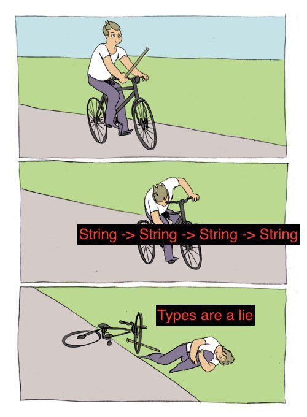

# Purely-Functional Webapps with scalajs-react

---

# Agenda

1. Introduce All-The-Things!
2. Using scalajs-react
3. Whirlwind Tour
4. Final Words

---

# 1. Introduce All-The-Things!

---

# Me

<div style="display:flex">
<div>
  
</div>
<div style="text-align:left; padding-left:1ex">
  <p>David Barri</p>
  <p>Github: https://github.com/japgolly</p>
  <p>Twitter: <a href="#">@japgolly</a></p>
  <p style="margin-top:2em">❤️ Creating</p>
  <p class="fragment">Programming - 29yrs (WTF?!)</p>
  <p class="fragment">Scala - 4.6yrs (16%)</p>
  <p class="fragment">FP - 4.3yrs (15%)</p>
</div>
</div>

---


I'm determined to make the best app for **Software Requirements** in the world!

<div class="fragment" />
<br>

Not public yet.

Email me at <a href="mailto:contact@shipreq.com">contact@shipreq.com</a> if you're interested.

---

## OSS

* microlibs
* nyaya
* scalacss
* scalajs-benchmark
* scalajs-react
* test-state
* univeq

*(All used in ShipReq)*

---

# FP

* Functions are values
* Immutability
* Purity
* Referential transparency
* Strong static types*

Note: Intro to those who don't know FP. Clarify what I mean by it.

---

# Libraries vs Frameworks

* Your code: Outside / Inside
* Interaction: Call functions / Provide parameters
* Composability: Yes / Nope
* Freedom: Huge / Anticipated
* Size: Small / Big

---

# React

* JS library by Facebook
* Library, not a framework
* Pure functions - no template language*
* Unidirectional - no two-way binding
* Virtual DOM

---

## React Summary

* Components
  * `Props => VDOM`
  * `{var s: State; (Props, State) => VDOM}`

* `(Component, DOM) => Unit`

---

# Scala.JS

<ul>
<li>Write Scala, emit JS</li>
<li class="fragment">
  Static types for your frontend
  <ul>
  <li>compile-time proof of correctness</li>
  <li>future-proof intent</li>
  <li>easily cull code</li>
  </ul>
</li>
</ul>

Note: li > "Why is this fantastic for frontend dev?" > li

---

# Scala.JS

<ul>
<li>
  Share code between client & server
  <ul>
  <li>Data structures</li>
  <li>Data values</li>
  <li>Logic</li>
  </ul>
</li>
<li class="fragment">Scala facades add types over raw JS</li>
</ul>

Note: Depending on the library, using a SJS facade is as {,un}safe as using raw JS. Often a Scala layer is required.

---

# scalajs-react

<ul>
<li>
I'm the author *(hi!)*
</li><li>
Library, not a framework
</li><li>
  Much more than a Scala.JS facade
  <ul class="fragment">
  <li>Type-safe as possible</li>
  <li>FP principals</li>
  <li>Test support</li>
  <li>Utilities</li>
  </ul>
</li></ul>

---

"Type-safe" can be a buzzword



---

"Type-safe" ≠ "Compiles in typed language"


---

This is "type-safe"...

```scala
def hmmm:
  (Either[Int, Char], Either[Int, Char]) =>
  Either[Int, (Char, Char)]
```

<div class="fragment" />

How many implementations will scalac will accept?

<div class="fragment" />

<ul style="font-family: monospace; font-size: 58%;">
<li>(2^32 + 2(2^16)) ^ 2(2^32 + 2^16)</li>
<li class="fragment">(2^32 + 2^17) ^ (2^33 + 2^17)</li>
<li class="fragment">4,295,098,368 ^ 8,590,065,664</li>
<li class="fragment">≈ 3.05 . 10 ^ 82,747,871,594</li>
<li class="fragment">≈ 47,500 volumes of 1000-page books</li>
<li class="fragment">≈ 4231 copies of The Malazan Book of the Fallen</li>
</ul>

<div class="fragment" />

**How many implementations did you intend?**

---

```scala
def better:
  (Either[ErrorCode, LoginToken], Either[ErrorCode, AuthToken]) =>
  Either[ErrorCode, Session]
```

scalac will forever enforce your intent

---

```scala
def great[E, A, B]:
  (Either[E, A], Either[E, B]) =>
  Either[E, (A, B)]
```

How many implementations will scalac will accept?

<div class="fragment" />

Answer: 2

<div class="fragment" />
<br/>

```c
Either[E, (A, B)]
2 + (1 * 1)
3
```
(Bonus: only 3 possible results)

---

scalajs-react is as type-safe as possible,

sometimes as reasonable.

<div class="fragment" />
<br>

Scala's types aren't strong enough to cover 100%,

more like 80% (?)

---

## Modules

* core
* extra
* test

*↑ no Scala dependencies ↑*

<div class="fragment" />

* ext-scalaz → Scalaz
* ext-cats → Cats
* ext-monocle → Monocle → Scalaz

---

## Is it production-ready?
Aww yisssss...

* Scastie - An interactive playground for Scala <br> https://scastie.scala-lang.org

* ScalaFiddle - <br> online playground for creating, sharing and embedding Scala fiddles <br> https://scalafiddle.io

* ShipReq

* Many more; I'm sorry

---

# 2. Using scalajs-react

---

## VDOM

```scala
import japgolly.scalajs.react.vdom.all._

// <a href="abc" title="click me">Hi</a>

a(
  href  := "abc",
  title := "click me",
  "Hi")
```

<div class="fragment" />

I do not recommend this!

---

Namespace conflicts

```scala
def doStuff[A, B](a: A, b: B, id: String, name: String) =
  ...
  // how do I create my
  // <a id="" name=""><b>Oops</b></a>
  // ???
```

a, b, data, id, key, list, name, src, value, etc.

---

```scala
import japgolly.scalajs.react.vdom.html_<^._

// <a href="abc" title="click me">Hi</a>

<.a(
  ^.href  := "abc",
  ^.title := "click me",
  "Hi")
```

<div class="fragment" />

SVG too
```scala
import japgolly.scalajs.react.vdom.svg_<^._
```

---

## Styles

Styles are in the attribute namespace
```scala
// <div style="margin:0 auto; textAlign:right; color:#444">Hello</div>

<.div(
  ^.margin := "0 auto",
  ^.textAlign.right,
  ^.color := "#444",
  "Hello")
```

---

The `style` attribute expects raw JS
```js
// JS
const manualJsObject = {
  margin   : "0 auto",
  textAlign: "right",
  color    : "#444"
};
```

```scala
// Scala.JS
val manualJsObject: js.Object =
  js.Dynamic.literal(
    margin    = "0 auto",
    textAlign = "right",
    color     = "#444")

// <div style="margin:0 auto; textAlign:right; color:#444">Hello</div>
<.div(^.style := manualJsObject, "Hello")
```

---

### Three symbolic operators:

* `attr := value`
* `eventAttr --> callback`
* `eventAttr ==> (event => callback)`

<br><br>

### Collections, optional VDOM, more…

https://github.com/japgolly/scalajs-react/blob/master/doc/VDOM.md

---

## Your First Component

```scala
import japgolly.scalajs.react._
import japgolly.scalajs.react.vdom.html_<^._

object Example {

  val Component = ScalaComponent.static("Example")(
    <.div("Hello from scalajs-react!"))

}
```

---

## Your First App

```scala
import org.scalajs.dom

object MyApp {
  def main(): Unit = {
    val container = dom.document.getElementById("root")
    Example.Component().renderIntoDOM(container)
  }
}
```

```html
<!DOCTYPE html>
<html>
  <head></head>
  <body>
    <div id="root"> YOUR APP MOUNTS HERE </div>
    <script src="https://cdnjs.cloudflare.com/ajax/libs/react/15.6.1/react.js"></script>
    <script src="https://cdnjs.cloudflare.com/ajax/libs/react/15.6.1/react-dom.js"></script>
    <script src="target/scala-2.12/example-fastopt.js"></script>
  </body>
</html>
```
<!-- .element: class="fragment" -->

---

## Components

We saw `ScalaComponent.static(name)(vdom)`

Typically you'll use `ScalaComponent.builder`

---

### Step 1: Type of Props + Name

```scala
ScalaComponent.builder[Props]("Name")
```

Usually with:
```scala
final case class Props(…)
// or
type Props = …
```

---

### Step 2: State type and initial value

Optional. Default = `Unit` = stateless

```scala
ScalaComponent.builder[Props]("Name")
  .initialState(State.init)
```

Usually with:
```scala
final case class State(…)
// or
type State = …

// and

object State {
  def init: State =
    ???
}
```

---

### Step 3a: Backend

Optional. Default = `Unit` = no backend

<br>


Implicit React concept. Two uses:
1. Contain state that doesn't affect rendering
2. Component logic

<div class="fragment" />

```scala
ScalaComponent.builder[Props]("Name")
  .initialState(State.init)
  .backend(new Backend(_))
```

Usually with:
```scala
final class Backend(bs: BackendScope[Props, State]) {
  // …
}
```

---

### Step 3b: Render function

Full form: (Scope)(Props, Children, State) => VdomElement

```
render [_] [P] [C] [S]
```

<div class="fragment" />

Example:
```scala
ScalaComponent.builder[Props]("Name")
  .initialState(State.init)
  .backend(new Backend(_))

  // Given the above...

  .render_S(state => <.div("Current state is " + state))

  .render_PS((props, state) => <.div(s"Current props is $props, state is $state"))
```

---

### Step 4: Lifecycle callbacks
Optional

```scala
ScalaComponent.builder[Props]("Name")
  .initialState(State.init)
  .backend(new Backend(_))
  .render_S(state => <.div(s"Current state is $state."))

  .componentDidUpdate(scope => Callback {
    println(s"Component state changed from ${scope.prevState} to ${scope.currentState}.")
  })
```

---

### The End

Call `.build` to complete.

<div class="fragment" />

```scala
ScalaComponent.builder[Int]("AmazingExpo")
  .render_P(n => <.div(s"$n² = ${n * n}"))
  .build
```
(only two mandatory steps)

---

Steps 3a & 3b (`.backend` & `.render`) can be combined

<div class="fragment" />

```scala
ScalaComponent.builder[Int]("AmazingExpo")
  .renderBackend[MyBackend]
  .build
```
with
```scala
final class MyBackend(bs: BackendScope[Int, Unit]) {
  def render(n: Int): VdomElement =
    <.div(s"$n² = ${n * n}")
}
```

---

## Components

scalajs-react can model any kind of component using the same interfaces:
* JS, Scala, Clojure
* Standard or "functional"
* Other React libs

https://github.com/japgolly/scalajs-react/blob/master/doc/TYPES.md

---

`ScalaComponent` is really a type of JS component

```scala
def fromReactClass[P, C <: Children, S, B](js: raw.ReactClass[Box[P], Box[S]])
                                          (implicit ctorType: CtorType.Summoner[Box[P], C])
                                          : Scala.Component[P, S, B, ctorType.CT] =
  Js.component[Box[P], C, Box[S]](js)(ctorType)
    .addFacade[Vars[P, S, B]]
    .cmapCtorProps[P](Box(_))
    .mapUnmounted(_
      .mapUnmountedProps(_.unbox)
      .mapMounted(ScalaComponent.mountedRoot(_)))
```

`ScalaComponent.builder` has no special privileges

---

All expose their roots (`.root`)

All expose their raw JS values (`.raw`)

ScalaComponents expose their underlying JsComponents (`.js`)

Great for interop / weird hacking.

---

## Using a 3rd-party React lib

Two steps:

1. Create Scala.JS facades

2. Create a `JsComponent`

---

## Example: react-collapse

https://github.com/nkbt/react-collapse

---

Scala.JS facades

```scala
@JSName("ReactCollapse")
@js.native
object RawComponent extends js.Object
```

```scala
@js.native
trait Props extends js.Object {
  var isOpened : Boolean                      = js.native
  var onMeasure: js.Function1[Measures, Unit] = js.native
  var onRest   : js.Function0[Unit]           = js.native
}

@js.native
trait Measures extends js.Object {
  val height: Double = js.native
  val width : Double = js.native
}
```

---

scalajs-react wrapper

```scala
val component = JsComponent[Props, Children.Varargs, Null](RawComponent)
```

<br>

Full example:

https://github.com/japgolly/scalajs-react/blob/master/doc/INTEROP.md

---

# Side-effects!

A program without side-effects either:
* calculates a value
* loops forever

<div class="fragment" />
<br>

A web site without side-effects:
```scala
ScalaComponent.static("Example")(
  <.div("Hello from scalajs-react!"))
```

---

Dynamic webapps need side-effects.

<br>

React accomplishes by:
* updating component's state
* re-rendering component with different Props

---

<pre><code class="lang-scala" data-trim data-noescape>
ScalaComponent.builder[Unit]("Example")
  .initialState(0)
  .renderBackend[MyBackend]
  .build

final class MyBackend(bs: BackendScope[Unit, Int]) {
  def render(state: Int): VdomElement =
    <.div(
      <.div("Current state: ", state),
      <.button("Reset",     ^.onClick --> <mark>???</mark>),
      <.button("Increment", ^.onClick --> <mark>???</mark>))
}
</code></pre>

---

<pre><code class="lang-scala" data-trim data-noescape>
ScalaComponent.builder[Unit]("Example")
  .initialState(0)
  .renderBackend[MyBackend]
  .build

final class MyBackend(<mark>bs: BackendScope[Unit, Int]</mark>) {
  def render(state: Int): VdomElement =
    <.div(
      <.div("Current state: ", state),
      <.button("Reset",     ^.onClick --> <mark>bs.setState(0)</mark>),
      <.button("Increment", ^.onClick --> <mark>bs.modState(_ + 1)</mark>))
}
</code></pre>

---

#### I said:
* scalajs-react is type-safe
* "Purely-Functional Webapps…"
* Side-effects are necessary

<br>

What's the type of `.setState`?

<div class="fragment" />

`Callback`

(`CallbackTo[Unit]`)

---

In scalajs-react, all library side-effects are `Callback`s.

You're expected to do the same for custom side-effects.

It's not hard... Instead of:
<pre><code class="lang-scala" data-trim data-noescape>
def sayHello<mark>(): Unit = {</mark>
  println("HELLO!")
}
</code></pre>

<pre><code class="lang-scala" data-trim data-noescape>
def sayHello<mark> = Callback {</mark>
  println("HELLO!")
}
</code></pre>

Wrapping in `Callback` makes side-effects pure.

---

### How?

```scala
println("HELLO!")
```
* Mutates your screen
* Returns the value `()`
* Not referentially transparent

<div class="fragment" />

```scala
println("HELLO!"); println("HELLO!")

// this ↑ is not the same as ↓

val f = println("HELLO!")
f; f
```

---

### Functions

```scala
() => println("HELLO!")
```
* Immutable
* Type is `() => Unit`
* Referentially transparent

<div class="fragment" />

```scala
( ()=>println("HELLO!") , ()=>println("HELLO!") )

// this ↑ is the same as ↓

val f = ()=>println("HELLO!")
(f, f)
```

<div class="fragment" />

*If* we decide to execute it later:
```scala
f()
```

---

### Strings (!)

```scala
"println(\"HELLO!\")"
```
* Immutable
* Type is `String`
* Referentially transparent

<div class="fragment" />

```scala
"println(\"HELLO!\")" + "println(\"HELLO!\")"

// this ↑ is the same as ↓

val f = "println(\"HELLO!\")"
f + f
```

<div class="fragment" />

*If* we decide to execute it later:
```scala
scalac.compile(f).execute() // or whatever
```

---

## Benefits

* Blessing of the *Holy Church of Purity and Functional Programming*
* Just like functions as values beneficial, side-effects as values <!-- .element: class="fragment" -->
* Describe intent <!-- .element: class="fragment" -->
* Repeatable <!-- .element: class="fragment" -->
* Meta-programming (retries, resource management, …) <!-- .element: class="fragment" -->
* Ensure separation between pure logic and side-effects <!-- .element: class="fragment" -->

---

> "Ensure separation between pure logic and side-effects"
> <div style="text-align:right; padding-right:1ex">-David Barri, <em>The Benefits of <code>Callback</code></em><br>2 sec ago</div>

<div class="fragment" />

1. scalajs-react asks for side-effects as `Callback`
2. scalajs-react passes to React
3. React executes when/if it wants

<b>You do not execute `Callback`s yourself.</b>

---

```scala
val MyComponent = ScalaComponent.builder[Unit]("X")
  .initialState(0)
  .renderBackend[MyBackend]
  .build

final class MyBackend(bs: BackendScope[Unit, Int]) {
  def render(state: Int): VdomElement = {
    bs.modState(_ + 1) // Does nothing. We haven't broken the law!
    <.div("The current state is ", state)
  }
}
```

Useless, but not a bug

---

```scala
def render(state: Int): VdomElement = {
  val inc = bs.modState(_ + 1)
  <.div(
    <.div("The current state is ", state),
    <.button("Increment", ^.onClick --> inc))
}
```

In impure-world, this would be a bug.<br>No help from scalac.

---

```scala
def debug[A](name: String, f: CallbackTo[A]): CallbackTo[A] =
  for {
    _ <- Callback.log(s"[$name] starting...")
    a <- f
    _ <- Callback.log(s"[$name] finished...")
  } yield a

val inc = debug("Increment", bs.modState(_ + 1))

def render(state: Int): VdomElement =
  <.div(
    <.div("The current state is ", state),
    <.button("Increment", ^.onClick --> inc))
```

<div class="fragment" />

In impure-world, you'd have to be careful about
* `def`, not `val`
* `=>A` <span style="padding:0 1.2ex">or</span> `()=>A`<span style="padding:0 1.2ex 0 0">,</span> not `A`
* `f` <span style="padding:0 1.2ex">or</span> `f()` <span style="padding-left:2ex; font-size:70%">(`;` = `Any⇒Unit`)</span>
* Probably more - Joyously, I don't care <!-- .element: class="fragment" -->

<div class="fragment" />

## No help from scalac

---

```scala
def inc(): Unit = {
  println("SimIncrement")
}

def render(state: Int): VdomElement = {
  <.div(
    <.div("The current state is ", state),
    <.button("Increase", ^.onClick --> inc)) // Error: Expected Callback, not Unit
}
```

Teach scalac and it will help you.

---

* Never ASK for `Unit`
* Never RETURN `Unit`

scalac loses its mind, becomes JS.

---

## `Callback` composition

* for-comprehension
* `map` & `flatMap`
* `>>` & `>>=`
* heaps more

---

## Stdlib-optimised Sequence & Traverse

* `Callback` / `CallbackTo`
  * `traverse`
  * `traverseOption`
  * `sequence`
  * `sequenceOption`
* `CallbackTo.liftTraverse`

```scala
def loadUser(id: UserId): CallbackTo[User] =
  ???

def loadAllUsers(ids: List[UserId]): CallbackTo[List[User]] =
  CallbackTo.traverse(ids)(loadUser)
```

---

## Many other helpful functions to explore

<pre><code class="lang-scala" data-trim data-noescape>
def loadUser(id: UserId): CallbackTo[User] =
  ???

<span class="fragment">loadUser(UserId(123))               // CallbackTo[User]</span>
<span class="fragment">  .logDuration(d => s"It took $d!") // CallbackTo[User]</span>
<span class="fragment">  .attempt                          // CallbackTo[Either[Throwable, User]]</span>
<span class="fragment">  .delayMs(100)                     // CallbackTo[Future[Either[Throwable, User]]]</span>
<span class="fragment">  .when(true)                       // CallbackTo[Option[Future[Either[Throwable, User]]]]</span>
</code></pre>

Browse the source:

https://github.com/japgolly/scalajs-react/blob/master/core/src/main/scala/japgolly/scalajs/react/Callback.scala

---

# Composing Components

---

Let's make a TODO list (*sigh*)

```scala
type State = Vector[String]

object State {
  def init: State = Vector.empty
}
```
<!-- .element: class="fragment" -->

```scala
ScalaComponent.builder[Unit]("TodoList")
  .initialState(State.init)
  .renderBackend[TodoListBackend]
  .build
```
<!-- .element: class="fragment" -->

```scala
final class TodoListBackend($: BackendScope[Unit, State]) {

  val addButton =
    <.button(
      ^.onClick --> $.modState(_ :+ "new item"),
      "Add")

  def render(s: State): VdomElement =
    <.div(
      <.ul(s.map(<.li(_)): _*), // better: s.indices.toVdomArray(i => <.li(^.key := i, s(i)))
      addButton)
}
```
<!-- .element: class="fragment" -->

---

Let's extract a Button Component!

<div style="font-size:60%">A component just for a button?<br>Contrived?</div>

---


<!-- .element: style="border-width:0" -->

```scala
// FilterDead = HideDead | ShowDead

type Props = StateSnapshot[FilterDead] // StateSnapshot[A] = (A, A => Callback)

val Component = ScalaComponent.builder[Props]("FilterDeadButton")
  .render_P(render)
  .configure(Reusability.shouldComponentUpdate)
  .build

private def render(p: Props) =
  renderButton(p.value)(^.onClick --> p.modState(!_))

private val renderButton: FilterDead => VdomTag =
  FilterDead.memo { fd =>
    val (btnColour, iconColour, tipText) = fd match {
      case HideDead => (Colour.Default, Colour.Grey   , "Click to show deleted content.")
      case ShowDead => (Colour.Red    , Colour.Default, "Showing deleted content.")
    }
    val icon  = Icon.TrashOutline.withSize(Size.Large).withColour(iconColour)
    val btn   = Button(`type` = Button.Type.IconOnly(icon), colour = btnColour)
    val popup = Popup.Css(tipText, Popup.Position.LeftCenter)
    btn.tag(popup)
  }
```
<!-- .element: class="stretch" -->

---

New component:
<pre><code class="lang-scala" data-trim data-noescape>
object AddButton {
  type Props = <mark>???</mark>

  val Component = ScalaComponent.builder[Props]("AddButton")
    .render_P(p =>
      <.button(^.onClick --> <mark>???</mark>, "Add"))
    .build
}
</code></pre>

<div class="fragment" />

Let's use it:
<pre><code class="lang-scala" data-trim data-noescape>
final class TodoListBackend($: BackendScope[Unit, State]) {

  def render(s: State): VdomElement =
    <.div(
      <.ul(s.map(<.li(_)): _*),
      AddButton.Component(<mark>???</mark>))
}
</code></pre>

---

Let's pass the backend...

<pre><code class="lang-scala" data-trim data-noescape>
object AddButton {
  type Props = <mark>TodoListBackend</mark>

  val Component = ScalaComponent.builder[Props]("AddButton")
    .render_P(p =>
      <.button(^.onClick --> <mark>p.addNewItem</mark>, "Add"))
    .build
}
</code></pre>

<pre><code class="lang-scala" data-trim data-noescape>
final class TodoListBackend($: BackendScope[Unit, State]) {

<mark>  val addNewItem: Callback =
    $.modState(_ :+ "new item")</mark>

  def render(s: State): VdomElement =
    <.div(
      <.ul(s.map(<.li(_)): _*),
      AddButton.Component(<mark>this</mark>))
}
</code></pre>

---

<div style="display:flex">
<div style="width:50%; text-align:right; padding-right:10rem">

</div>
<div style="width:50%; text-align:left; padding-left:0rem">
<h1 style="padding:0; margin:-5rem 0 0 0; font-size:1400%">NO!</h1>
<ul style="margin-top:-5rem" class="fragment">
<li>Tightly-coupled</li>
<li>Testability difficult</li>
<li>Not reusable</li>
</ul>
</div>
</div>

---

Request the minimum required:
<pre><code class="lang-scala" data-trim data-noescape>
object AddButton {
  type Props = ???

  val Component = ScalaComponent.builder[Props]("AddButton")
    .render_P(p =>
      <.button(^.onClick --> <mark>???</mark>, "Add"))
    .build
}
</code></pre>

<pre style="visibility:hidden"><code class="lang-scala" data-trim data-noescape>
final class TodoListBackend($: BackendScope[Unit, State]) {

  def render(s: State): VdomElement =
    <.div(
      <.ul(s.map(<.li(_)): _*),
      AddButton.Component(<mark>$.modState(_ :+ "new item")</mark>))
}
</code></pre>

---

The minimum required = `Callback`
<pre><code class="lang-scala" data-trim data-noescape>
object AddButton {
  type Props = <mark>Callback</mark>

  val Component = ScalaComponent.builder[Props]("AddButton")
    .render_P(p =>
      <.button(^.onClick --> <mark>p</mark>, "Add"))
    .build
}
</code></pre>

<div class="fragment" />

<pre><code class="lang-scala" data-trim data-noescape>
final class TodoListBackend($: BackendScope[Unit, State]) {

  def render(s: State): VdomElement =
    <.div(
      <.ul(s.map(<.li(_)): _*),
      AddButton.Component(<mark>$.modState(_ :+ "new item")</mark>))
}
</code></pre>

Note: That's how you compose components: instantiate B in A's VDOM

---

## WHEN TO STATEFUL...

Think of stateful components as mutable classes.

---

```c
Page
  ↳ ActiveUsers
      ↳ UserProfile *
          ↳ BillingAddress
              ↳ TextBox
```

---

```c
Page *
  ↳ ActiveUsers *
      ↳ UserProfile *
          ↳ BillingAddress
              ↳ TextBox
```

---

```C
Page
  ↳ ActiveUsers
      ↳ UserProfile
          ↳ BillingAddress
              ↳ TextBox *
```

---

```C
Page *
  ↳ ActiveUsers *
      ↳ UserProfile *
          ↳ BillingAddress *
              ↳ TextBox *
```

---

Stateful is "OK" when...
* One of a kind **and** always on screen
* Or, state is transient and has a very limited lifetime

Note: Not one of a kind = React can get confused. Not always on screen = React discards state!

---

### Stateless FTW!

```C
Root *
  ↳ Page
      ↳ ActiveUsers
          ↳ UserProfile
              ↳ BillingAddress
                  ↳ TextBox
```

---

# AJAX

React is a DOM library, not a framework.

Nothing out-of-the-box necessary. Do what you like.

---

Plain JS looks like this:

```js
// Taken from http://youmightnotneedjquery.com/


var request = new XMLHttpRequest();
request.open('GET', '/my/url', true);

request.onload = function() {
  if (request.status >= 200 && request.status < 400) {
    // Success!
    var resp = request.responseText;
  } else {
    // We reached our target server, but it returned an error
  }
};

request.onerror = function() {
  // There was a connection error of some sort
};

request.send(data);
```
<!-- .element: class="stretch" -->

---

Plain Scala.JS looks like this:

```scala
import org.scalajs.dom.{ErrorEvent, Event, XMLHttpRequest}


val request = new XMLHttpRequest()
request.open("GET", "/my/url", true)

request.onload = (e: Event) => {
  if (request.status >= 200 && request.status < 400) {
    // Success!
    val resp = request.responseText
  } else {
    // We reached our target server, but it returned an error
  }
}

request.onerror = (e: ErrorEvent) => {
  // There was a connection error of some sort
}

request.send(data)
```
<!-- .element: class="stretch" -->

---

Using with React (1/2)

<pre class="stretch"><code class="lang-scala" data-trim data-noescape>
import org.scalajs.dom.{ErrorEvent, Event, XMLHttpRequest}


val request = new XMLHttpRequest()
request.open("GET", "/my/url", true)

request.onload = (e: Event) => {
  if (request.status >= 200 && request.status < 400) {
    // Success!
    val resp = request.responseText
    <mark>component.setState(Right(resp))</mark>
  } else {
    // We reached our target server, but it returned an error
    <mark>component.setState(Left("It failed!"))</mark>
  }
}

request.onerror = (e: ErrorEvent) => {
  // There was a connection error of some sort
  <mark>component.setState(Left("IT FAILED WITH SHAME!!"))</mark>
}

request.send(data)
</code></pre>

---

Using with React (2/2)

<pre class="stretch"><code class="lang-scala" data-trim data-noescape>
<mark>Callback {</mark>
  <mark>val c = component.withEffectsImpure</mark>

  val request = new XMLHttpRequest()
  request.open("GET", "/my/url", true)

  request.onload = (e: Event) => {
    if (request.status >= 200 && request.status < 400) {
      // Success!
      val resp = request.responseText
      <mark>c</mark>.setState(Right(resp))
    } else {
      // We reached our target server, but it returned an error
      <mark>c</mark>.setState(Left("It failed!"))
    }
  }

  request.onerror = (e: ErrorEvent) => {
    // There was a connection error of some sort
    <mark>c</mark>.setState(Left("IT FAILED WITH SHAME!!"))
  }

  request.send(data)
}
</code></pre>

---

## Do scalajs-react users all manually
## write their own ajax methods
# in every project?!

I'm the wrong person to ask.

---

## autowire

https://github.com/lihaoyi/autowire

```scala
// shared interface
trait Api {
  def add(x: Int, y: Int, z: Int): Int
}

// server-side router and implementation
object Server extends autowire.Server...
object ApiImpl extends Api
  def add(x: Int, y: Int, z: Int) = x + y + z
}

// client-side callsite
object Client extends autowire.Client...
Client[Api].add(1, 2, 3).call(): Future[Int]
//         |    |             |
//         |    |             The T is pickled and wrapped in a Future[T]
//         |    The arguments to that method are pickled automatically
//         Call a method on the `Api` trait
```
<!-- .element: class="stretch" -->

(No scalajs-react integration utils/lib AFAIK) <!-- .element: style="opacity:.7" -->


---

<b style="color:#fff">Tricky part isn't making the AJAX call, it's your UI & UX</b>

* Solution is dependent on your webapp's global UX theme/strategies
* The AJAX call itself is a tiny fraction of the solution
* UX needs → Types → compiler enforces your UX rules
* A library that integrated AJAX with React would probably constrain UX


---

Super-Small Example

```scala
/**
  * @tparam F An explanation of why some async action failed.
  */
sealed trait AsyncState[+F]
```

```scala
  /** An async action is in progress, result pending */
  case object InProgress extends AsyncState[Nothing]

  /** @param failure An explanation of why some async action failed.
    * @param cancel Return to the state prior to initiating the async action.
    *               For editors, this restores the editor, makes it editable again and retains
    *               its dirty state.
    */
  final case class Failed[+F](failure: F, retry: Callback, cancel: Callback)
    extends AsyncState[F]
```

---

Start building a theme

```scala
def render(asyncState: Option[AsyncState], …) =
  asyncState match {
    case None                        => // render normally
    case Some(AsyncState.InProgress) => // disable inputs/button, show spinner
    case Some(f: AsyncState.Failed)  => // display error, show retry and/or cancel buttons
  }
```

---

# 3. Whirlwind Tour

Get ready to...

Note: You're not expected to retain this. I just want to let you know what's available and where to find more detail if you're interested.

---

<!-- .slide: data-background="WHIRL.svg" data-background-size="100% 100%" -->

---

# (SPA) Router

```scala
sealed trait Page
case object Home                              extends Page // https://example.com
case object Search                            extends Page // https://example.com/search
case object Items                             extends Page // https://example.com/items
case class ItemInfo(category: Int, item: Int) extends Page // https://example.com/cat/3/item/7

val routerConfig = RouterConfigDsl[Page].buildConfig { dsl =>
  import dsl._

  val itemInfoRoute = ("/cat" / int / "item" / int).caseClass[ItemInfo]

  ( staticRoute(root,      Home)   ~> render(HelloComponent())
  | staticRoute("/search", Search) ~> render(SearchComponent())
  | staticRoute("/items",  Items)  ~> render(ProductList())
  | dynamicRouteCT(itemInfoRoute)  ~> dynRender(ProductPage(_))
  | staticRedirect("/find")        ~> redirectToPage(Search)(Redirect.Replace)
  | removeTrailingSlashes
  )
    .notFound(redirectToPage(Home)(Redirect.Replace))
}
```
<!-- .element: class="stretch" -->

---

`RouterCtl[A]`

```scala
final case class Props(routerCtl: RouterCtl[Page], …)

ScalaComponent.builder[Props]("Example")
  .render_P(p =>
    p.routerCtl.link(Search)("Search Page!")) // <a href="/search" onClick="…">Search Page!</a>
  .build
```

* URLs always accurate.
* `contramap[B](f: B ⇒ A): RouterCtl[B]`

---

Many more capabilities and options available.<br>
See: https://github.com/japgolly/scalajs-react/blob/master/doc/ROUTER.md

<br>

The live demos @ https://japgolly.github.io/scalajs-react/ use the Router.<br>

Source code available in `gh-pages` module.<br>
See: https://github.com/japgolly/scalajs-react/tree/master/gh-pages

---

# Testing

---

## scalajs-react 'test' module

* Unit tests
* Simulate events *(click this, mouse-over that)*
* Assert components' output (HTML)
* Assert components' event handlers & state changes

https://github.com/japgolly/scalajs-react/blob/master/doc/TESTING.md

---

## Scala Test-State

* Library for testing stateful things
* Scala (JVM) & Scala.JS
* Has modules for DOM and scalajs-react
* Combine imperative & property testing
* Usage is pure

---

Invariants (properties)
```scala
dsl.focus("Total and (complete + pending) in summary")
  .compare(_.obs.summaryTotal, i => i.obs.summaryComplete + i.obs.summaryPending)
  .assert.equal
```

Actions (imperative)
```scala
addItem("hello")
  >> addItem("hello2")
  >> addItem(" blah 3 ")    +> visibleItemNames.assert.contains("blah 3")
  >> completeItem("hello2") +> visibleItemNames.size.assert.decrement
  >> toggleShowCompleted    +> visibleItemNames.size.assert.increment
  >> toggleShowCompleted    +> visibleItemNames.assert("hello", "blah 3")
```

---


---

Project and doco:<br>
https://github.com/japgolly/test-state

<br>

scalajs-react full example:<br>
https://github.com/japgolly/test-state/tree/master/example-react

---

# ScalaCSS

ScalaCSS
* Library for creating CSS
* Scala (JVM) & Scala.JS
* Has modules for ScalaTags and scalajs-react

---

React styles:
* No media queries
* No conditions (`:hover`)
* Can't style children
* Minimal type-safety
* Inline = more parsing, more CSSOM (possibly negligible)

---

ScalaCSS
* Media queries: no problem
* Conditions: no problem
* Styling children: no problem
* Maximal type-safety
* Stylesheet = one-time parsing, one-time CSSOM

---

ScalaCSS
* Class-based UI libs (eg. Bootstrap)
* Style conflict detection
* Browser prefixes

https://github.com/japgolly/scalacss

---

# Performance

React workflow summary

1. Create page VDOM
2. Diff with previous VDOM
3. Apply VDOM changes to real DOM
4. Repeat

Every change a whole page worth of VDOM is created and compared.

---

# React Perf

https://facebook.github.io/react/docs/perf.html

From browser console:


---

## scalajs-react/extra:<br>Reusability

```scala
final case class Props(...)

implicit def reusabilityProps: Reusability[Props] =    // <---- Step 1
  Reusability.byRef || Reusability.caseClass

val Component = ScalaComponent.builder[Props]("Demo")
  .render_P(render)
  .configure(Reusability.shouldComponentUpdate)        // <---- Step 2
  .build
```

---

* (∀) `Reusability`
* (∃) `Reusable`
* Reusable functions
* Overlay

https://github.com/japgolly/scalajs-react/blob/master/doc/PERFORMANCE.md

https://japgolly.github.io/scalajs-react/#examples/reusability

---

## scalajs-react/extra:<br>Px

* Lightweight pull-based FRP
* Caching
* Integrates well with other parts of library

---

Typical usage:

Create and store `Px`s in the backend of a large/complicated component.

```scala
final case class Props(project: Project, ...)

final class Backend(bs: BackendScope[Props, Unit]) {

  private val pxProject: Px[Project] =
    Px.props(bs).map(_.project).withReuse.autoRefresh

  private val pxFilterValidator: Px[PotentialFilter.Validator] =
    pxProject.map(PotentialFilter.validator)
```

---

Add reuse to derivations
```scala
  private val pxColumnsAll: Px[Column.All] =
    (for {
      p  <- pxProject
      rs <- pxRows
      fd <- pxFilterDead
    } yield Column.All(p, fd).atRows(rs))
      .withReuse
```

---

VDOM: OK!
```scala
private val pxSelectionCtrls: Px[VdomElement] =
  for {
    project        <- pxProject
    projectWidgets <- pxProjectWidgets
    textSearch     <- pxTextSearch
    rows           <- pxRows
    sel            <- pxRowSelectionVisible
  } yield
    SelectionCtrls.Component(
      SelectionCtrls.Props(
        sel, rows, setModal, project, projectWidgets, textSearch, updateIO, rowAsyncW))
```

---

Read more about it at

https://github.com/japgolly/scalajs-react/blob/master/doc/PERFORMANCE.md#px

---

Last note on performance:

# scalajs-benchmark

* Provide Scala.JS code you want to benchmark
* Get a GUI for free
* GUI allows benchmark configuration (eg. params)

---

```scala
import japgolly.scalajs.benchmark._, gui._

object Example {

  val suite = GuiSuite(
    Suite("Example Benchmarks")(

      // Benchmark #1
      Benchmark("foreach") {
        var s = Set.empty[Int]
        (1 to 100) foreach (s += _)
        s
      },

      // Benchmark #2
      Benchmark("fold") {
        (1 to 100).foldLeft(Set.empty[Int])(_ + _)
      }

    )
  )
}
```
<!-- .element: class="stretch" -->

Doco: https://github.com/japgolly/scalajs-benchmark

Live benchmarks: https://japgolly.github.io/scalajs-benchmark/

---

# FP

* `CallbackOption`: `CallbackTo[Option[_]]` - [demo](https://japgolly.github.io/scalajs-react/#examples/callback-option)
* Component state monads - [demo](https://japgolly.github.io/scalajs-react/#examples/state-monad)
* Monocle support (optics) - [demo](https://japgolly.github.io/scalajs-react/#examples/state-snapshot)
* Scalaz/Cats typeclasses for library data
* Component support for other effect types

---

# "BUT MUH REDUX!"

Check out *Diode*.

 <!-- .element: style="background:#fff; padding:1rem" -->

https://github.com/suzaku-io/diode

---

## boopickle

https://github.com/suzaku-io/boopickle

The fastest and most size-efficient binary serialisation library for Scala & Scala.JS.

Can be used with autowire.

---

## scalajs-bundler

https://github.com/scalacenter/scalajs-bundler

Integrates webpack into SBT.

---

### My pipeline:

```c
npm/yarn --> webpack --> webtamp --> SBT --> Docker
|                              |      |        |
+------------------------------+      |        |
           run rarely                 |        |
                                   always      |
                                               |
                                          sbt docker
```

---

## webtamp

https://github.com/japgolly/webtamp/

* Compliments webpack
* Asset bundler (JS, CSS, HTML, images, etc)
* CDN with integrity support
* Generate Scala manifests

---

```scala
package shipreq.webapp.base

/** Generated by webtamp. */
object AssetManifest {
  final case class CDN(href: String, integrity: Option[String])

  def analyticsJs = "/s/4aa0f48c55c769567f922ebfbc3f99cf.js"

  def favicon = "/s/286b75985993da80759cbdc5142de4d3.ico"

  def katexCss = CDN(
    href = "https://cdnjs.cloudflare.com/ajax/libs/KaTeX/0.8.3/katex.min.css",
    integrity = Some("sha256-kAbX9Z5ZMhjo34PRGEMc7RiueevlbmDilvUt1NsZGAI="))

  def katexJs = CDN(
    href = "https://cdnjs.cloudflare.com/ajax/libs/KaTeX/0.8.3/katex.min.js",
    integrity = Some("sha256-Jv5VrSHYxxBmh18hQUviB4OiVzOkDHdO0uY4GtrCMDQ="))

  def loadingSpinSvg = "data:image/svg+xml;base64,PHN2ZyB4bWxucz0iaHR0cDovL3d3dy53My5vcmcvMjAwMC9zdmciIHZpZXdCb3g9IjAgMCAzMiAzMiIgd2lkdGg9IjMyIiBoZWlnaHQ9IjMyIiBmaWxsPSIjMjJjIj48cGF0aCBvcGFjaXR5PSIuMjUiIGQ9Ik0xNiAwYTE2IDE2IDAgMCAwIDAgMzIgMTYgMTYgMCAwIDAgMC0zMm0wIDRhMTIgMTIgMCAwIDEgMCAyNCAxMiAxMiAwIDAgMSAwLTI0Ii8+PHBhdGggZD0iTTE2IDBhMTYgMTYgMCAwIDEgMTYgMTZoLTRBMTIgMTIgMCAwIDAgMTYgNHoiPjxhbmltYXRlVHJhbnNmb3JtIGF0dHJpYnV0ZU5hbWU9InRyYW5zZm9ybSIgdHlwZT0icm90YXRlIiBmcm9tPSIwIDE2IDE2IiB0bz0iMzYwIDE2IDE2IiBkdXI9IjAuNXMiIHJlcGVhdENvdW50PSJpbmRlZmluaXRlIi8+PC9wYXRoPjwvc3ZnPg=="

  def loadjs = "/s/7f8f2966a3634ba5d1b206bc19d7c7ec.js"

  def memberLibBundleJs = "/s/ee37f1fed6947742b810ded90acba3e5.js"

  def reactDomJs = CDN(
    href = "https://cdnjs.cloudflare.com/ajax/libs/react/15.6.1/react-dom.min.js",
    integrity = Some("sha256-UEqn5+tyzezD6A5HBMNTlc5mXkmt+ohTfCBPtXMaGb0="))
```
<!-- .element: class="stretch" -->

---

More resources from the project page:

https://github.com/japgolly/scalajs-react

---

# 4. Final Words

---

## scalajs-react

https://github.com/japgolly/scalajs-react

* Plenty o' doco
* Live demos
* Real SPA (`gh-pages/`)
* Gitter room

---

thank you
